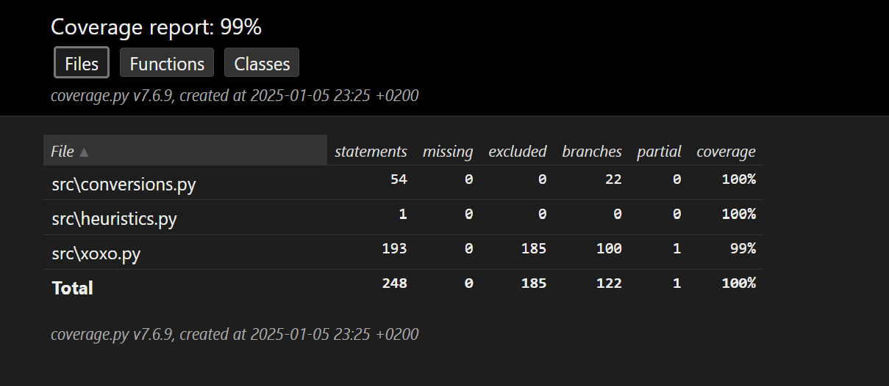
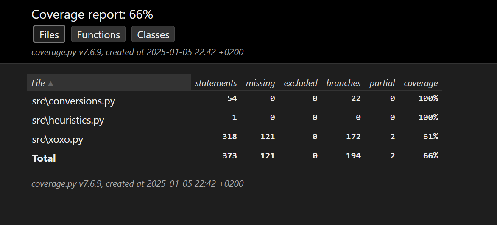

# TESTAUSDOKUMENTTI
Ohjelmaa tehtäessä ohjelman testaaminen koostui pääasiassa manuaalisesti tehdyistä järjestelmä- sekä yksikkötason testeistä. Kun ohjelman tila läheni valmista, testaaminen siirtyi vähitellen kohti unittestillä toteutettuja automatisoituja yksikkötestejä.

## AUTOMATISOIDUT YKSIKKÖTESTIT
- Ohjelma koostuu neljästä osasta:
    - ohjelman käynnistävästä ja sille alkuarvot antavasta tiedostosta ("main.py"),
    - ns. pääohjelmasta ("xoxo.py") joka sisältää myös minimax-algoritmin,
      
      sekä kahdesta pienemmästä tiedostosta, jotka sisältävät
      
    - siirtojen arvioinnissa käytetyt heuristiset arvot ("heuristics.py") ja
    - muunnoksissa käytetyt funktiot ("conversions.py").
- Näistä edellä mainituista pääohjelma eli tiedosto "xoxo.py" sisältää myös tekstikäyttöliittymään kuuluvia elementtejä, jotka on jätetty testikattavuuden ulkopuolelle.
- Samoin ohjelman käynnistävä tiedosto "main.py" on jätetty testikattavuuden ulkopuolelle.

## TESTiKATTAVUUS
- Sovelluksen testikattavuus on 99%, kun ulkopuolelle on rajattu testaukseen huonosti soveltuvat funktiot ja tiedosto. Testikattavuusraportin perusteella yksikään kohta ei ole jäänyt kokonaan testaamatta. Testikattavuuden prosentteja laskee osittaiset puutteet testikattavuudessa. Tämän testikattavuuden ulkopuolelle on jätetty tiedosto "main.py" sekä tiedostosta "xoxo.py" funktiot "draw_board()", "roll_the_game()", "play_the_game()" ja "ai_makes_move()". Myös loppuosa funktiosta "evaluate_board()" on jätetty testikattavuuden ulkopuolelle.

- Ilman testikattavuuden rajauksia testikattavuus on 66%

## MANUAALINEN JÄRJESTELMÄTESTAUS
- Manuaalista järjestelmätestausta suoritettiin kattavasti pitkin sovelluksen teon, mutta siitä ei luonnollisesti ole esittää sen kummempaa dokumentaatiota, koska manuaaliset testit on jo tähän mennessä poistettu tiedostoista.

## ASENNUS JA KONFIGUROINTI
- Sovellus on tehty ja testattu käytännössä kokonaisuudessaan windows-ypäristössä, lukuun ottamatta nopeaa kokeilua, jossa sovelluksen toiminta testattiin 'cubbli linux' virtuaaliympäristössä ja siihen tehtiin pieniä muutoksia.

## TOIMINNALLISUUDET
- Sovelluksen dokumentaatiossa määritellyt toiminnallisuudet on testattu toimiviksi eikä virheitä ole enää ilmaantunut toiminnallisuuksien käytön yhteydessä ainakaan merkittävissä määrin.
